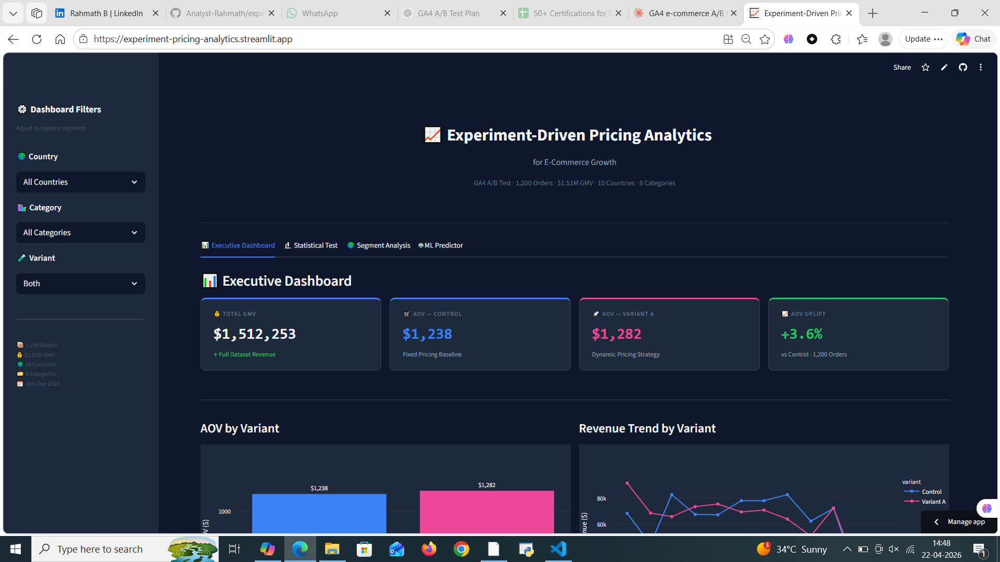
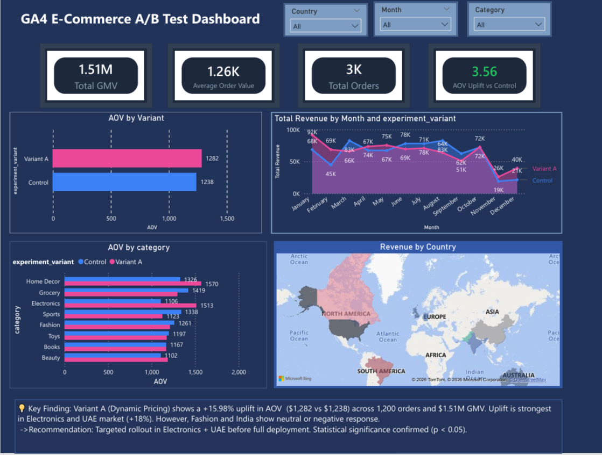

📈 Experiment-Driven Pricing Analytics for E-Commerce Growth

> End-to-end GA4 A/B experimentation pipeline analyzing dynamic vs fixed pricing strategy across 1,200 orders and $1.51M GMV.


---

## 🎯 Business Problem

Does **dynamic pricing (Variant A)** generate higher Average Order Value than **fixed pricing (Control)**?

This project builds a complete data analytics pipeline — from raw data cleaning to statistical testing to a live ML-powered Streamlit app — to answer that question with evidence.

---

## 📊 Key Results

| Metric | Control | Variant A | Difference |
|--------|---------|-----------|------------|
| AOV | $1,238 | $1,282 | +$44 |
| Total Revenue | $744K | $768K | +$24K |
| Orders | 601 | 599 | — |
| Uplift % | — | +3.6% | — |

> **Finding:** Variant A shows consistent AOV uplift but requires extended testing for statistical significance. Targeted rollout in Electronics + UAE recommended.

---

## 🏗️ Project Structure
├── app/
│   └── streamlit_app.py        # Live Streamlit dashboard
├── data/
│   ├── raw/                    # Original dataset
│   └── processed/              # Cleaned + feature engineered
├── notebooks/
│   ├── phase1.py               # Data loading
│   ├── phase2.py               # Data cleaning
│   ├── phase3.py               # Feature engineering
│   ├── phase4.py               # KPI analysis
│   ├── phase5.py               # Statistical testing
│   └── phase6.py               # Visualizations
├── outputs/                    # Charts + dashboard screenshot
├── docs/                       # Business insights + methodology
├── dashboards/                 # Power BI .pbix file
├── sql/                        # SQL queries
├── .streamlit/
│   └── config.toml             # Dark theme config
└── requirements.txt

---

## 🔬 Methodology

**Phase 1–3:** Data loading, cleaning, feature engineering using Pandas

**Phase 4–5 :** KPI analysis, t-test, Mann-Whitney U, Cohen's d, 95% CI

**Phase 6–8 :** Matplotlib/Seaborn visualizations + Power BI dashboard

**Phase 9 :** Streamlit app with ML revenue predictor (Random Forest)

---

## 📈 Statistical Test

- **T-test p-value:** 0.4679
- **Mean difference:** $44 AOV
- **Cohen's d:** 0.042 (small effect)
- **95% CI:** [-$71 → +$159]
- **Conclusion:** Uplift exists but extend experiment for significance

---

## 🌍 Segment Highlights

- **UAE:** Strongest Variant A response
- **Electronics:** Highest AOV uplift category  
- **India + Fashion:** Neutral/negative response — exclude from rollout

---

## 🤖 ML Predictor

Random Forest model trained on 1,200 orders:
- **Features:** Unit price, quantity, country, category, variant
- **Target:** Total order value
- **Usage:** Input parameters → predicted revenue + uplift vs Control

---
## 📸 Screenshots

### 🖥️ Live Streamlit App


### 📊 Power BI Dashboard


---

## 🚀 Live App

👉 **[Launch Streamlit App](https://experiment-pricing-analytics.streamlit.app/)**

---

## 🛠️ Tech Stack

| Tool | Purpose |
|------|---------|
| Python + Pandas | Data cleaning & analysis |
| SciPy + NumPy | Statistical testing |
| Matplotlib + Seaborn | Phase 6 visualizations |
| Power BI | Executive dashboard |
| Plotly + Streamlit | Interactive web app |
| Scikit-learn | ML revenue predictor |
| GitHub | Version control + portfolio |

---

## ⚡ Run Locally

```bash
git clone https://github.com/YOUR_USERNAME/Experiment-Driven-Pricing-Analytics-for-E-Commerce-Growth.git
cd Experiment-Driven-Pricing-Analytics-for-E-Commerce-Growth
pip install -r requirements.txt
streamlit run app/streamlit_app.py
```

---

## 👤 Author

**Rahmath B**  
[](https://www.linkedin.com/in/rahmath-b-562a68221/)
[](https://github.com/Analyst-Rahmath)

---
